# Хаос-инжиниринг Strimzi Kafka: проверка устойчивости к сбоям через Chaos Mesh

Цель проекта — проверить отказоустойчивость Strimzi Kafka в Kubernetes с помощью chaos-экспериментов (Chaos Mesh). Для этого разворачивается полный стенд: кластер Kafka (KRaft, 3 контроллера + 3 брокера), мониторинг (VictoriaMetrics K8s Stack, Grafana), сбор логов (VictoriaLogs), верификация сквозной доставки сообщений через Redis и Go-приложения producer/consumer. Затем последовательно применяются chaos-сценарии (pod-kill, network partition, CPU/memory stress, IO/DNS/JVM/HTTP chaos и др.) и проверяется, что кластер корректно восстанавливается без потери данных.

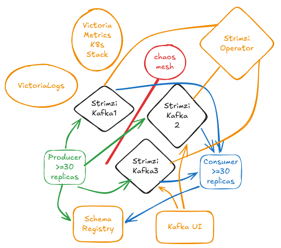

## Порядок развёртывания

1. [VictoriaMetrics K8s Stack](https://github.com/VictoriaMetrics/helm-charts/tree/master/charts/victoria-metrics-k8s-stack) + [Grafana](https://grafana.com/)
2. [Strimzi](https://strimzi.io/) Operator и [Cruise Control](https://github.com/linkedin/cruise-control) (Strimzi)
3. Strimzi Kafka (namespace, Kafka CR, топик, пользователь, PDB, Cruise Control с CronJob для ребаланса, метрики, [Kafka Exporter](https://github.com/prometheus-community/kafka_exporter))
4. Cбор метрик Kafka через JMX, Kafka Exporter и [kube-state-metrics](https://github.com/kubernetes/kube-state-metrics) для Strimzi CRD
5. Schema Registry ([Karapace](https://github.com/aiven/karapace)) для Avro
6. [Kafka UI](https://github.com/provectus/kafka-ui)
7. [Redis](https://redis.io/) в Kubernetes (верификация доставки, хеши сообщений Producer → Consumer)
8. Golang producer/consumer (Helm)
9. [VictoriaLogs](https://victorialogs.com/) и [victoria-logs-collector](https://github.com/VictoriaMetrics/victoria-logs-collector)
10. [Chaos Mesh](https://chaos-mesh.org/) — установка (Helm, VMServiceScrape, RBAC/Dashboard)
11. Импорт дашбордов Grafana
12. Chaos Mesh для проведения хаос-экспериментов (pod-kill, network-delay, CPU/memory stress, I/O chaos и др.)

## Установка стека мониторинга (VictoriaMetrics K8s Stack)

VictoriaMetrics K8s Stack: Готовый стек VictoriaMetrics + Grafana для метрик и дашбордов; совместим с Prometheus (PromQL), экономичен по ресурсам и удобно разворачивается через Helm.

1. Репозиторий Helm для VictoriaMetrics:

```bash
helm repo add vm https://victoriametrics.github.io/helm-charts/
helm repo update
```

2. Установить VictoriaMetrics K8s Stack с values из `victoriametrics-values.yaml` (Ingress для Grafana на `grafana.apatsev.org.ru`). Имя релиза и namespace `vmks` выбраны короткими, чтобы не упираться в лимит 63 символа для имён ресурсов Kubernetes.

```bash
helm upgrade --install vmks \
  oci://ghcr.io/victoriametrics/helm-charts/victoria-metrics-k8s-stack \
  --namespace vmks \
  --create-namespace \
  --wait \
  --version 0.70.0 \
  --timeout 15m \
  -f victoriametrics-values.yaml
```

Ссылка на исходный код: [`victoriametrics-values.yaml`](https://github.com/patsevanton/strimzi-kafka-chaos-testing/blob/main/victoriametrics-values.yaml)

3. Получить пароль администратора Grafana:

```bash
kubectl get secret vmks-grafana -n vmks -o jsonpath='{.data.admin-password}' | base64 --decode; echo
```

4. Grafana будет доступна по адресу http://grafana.apatsev.org.ru (логин по умолчанию: `admin`).

### Strimzi

[Strimzi](https://strimzi.io/) — оператор для развёртывания и управления Apache Kafka в Kubernetes; выбран как де-факто стандарт для Kafka в K8s (CNCF-проект, декларативные CRD, активная разработка). Мониторинг вынесен в отдельные компоненты (Kafka Exporter, kube-state-metrics, PodMonitors для брокеров и операторов).

### Установка Strimzi

Namespace `kafka-cluster` должен существовать заранее (как в оригинале strimzi-kafka-chaos-testing):

```bash
# Идемпотентно: создаёт namespace только если его ещё нет
kubectl get ns kafka-cluster 2>/dev/null || kubectl create namespace kafka-cluster
```

```bash
helm upgrade --install strimzi-cluster-operator \
  oci://quay.io/strimzi-helm/strimzi-kafka-operator \
  --namespace strimzi \
  --create-namespace \
  --set 'watchNamespaces={kafka-cluster}' \
  --wait \
  --version 0.50.0
```

Использовались манифесты из [examples](https://github.com/strimzi/strimzi-kafka-operator/tree/main/examples) Strimzi с адаптацией для VictoriaMetrics K8s Stack.

### Установка Kafka из examples

Kafka разворачивается с **внутренним listener на порту 9092 с аутентификацией SASL SCRAM-SHA-512** и **авторизацией simple** (для ACL в KafkaUser). Клиенты (Producer, Consumer, Schema Registry) подключаются с учётными данными KafkaUser. В **kafka-metrics.yaml** уже заданы `authorization.type: simple`; без этого KafkaUser с ACL не перейдёт в Ready и Secret `myuser` не будет создан.

```bash
# Kafka-кластер (KRaft, persistent, listener sasl:9092 с SCRAM-SHA-512, JMX и Kafka Exporter)
kubectl apply -n kafka-cluster -f strimzi/kafka-metrics.yaml

# Топик
kubectl apply -n kafka-cluster -f strimzi/kafka-topic.yaml

# Пользователь Kafka (SCRAM-SHA-512; оператор создаёт Secret myuser с паролем)
kubectl apply -n kafka-cluster -f strimzi/kafka-user.yaml
```

Ссылка на исходный код: [`strimzi/kafka-metrics.yaml`](https://github.com/patsevanton/strimzi-kafka-chaos-testing/blob/main/strimzi/kafka-metrics.yaml) · [`strimzi/kafka-topic.yaml`](https://github.com/patsevanton/strimzi-kafka-chaos-testing/blob/main/strimzi/kafka-topic.yaml) · [`strimzi/kafka-user.yaml`](https://github.com/patsevanton/strimzi-kafka-chaos-testing/blob/main/strimzi/kafka-user.yaml)

```bash
# Дождаться готовности Kafka (при первом развёртывании может занять 10–15 минут)
kubectl wait kafka/kafka-cluster -n kafka-cluster --for=condition=Ready --timeout=900s
```

### PodDisruptionBudget для Kafka

PodDisruptionBudget гарантирует, что минимум 2 брокера всегда доступны во время плановых прерываний (drain ноды, rolling updates).

```bash
kubectl apply -n kafka-cluster -f strimzi/kafka-pdb.yaml
kubectl get pdb -n kafka-cluster
```

Ссылка на исходный код: [`strimzi/kafka-pdb.yaml`](https://github.com/patsevanton/strimzi-kafka-chaos-testing/blob/main/strimzi/kafka-pdb.yaml)

### Cruise Control

[Cruise Control](https://github.com/linkedin/cruise-control) - компонент для ребаланса партиций Kafka (распределение реплик по брокерам, цели по загрузке CPU/сети/диска). В **kafka-metrics.yaml** включён **Cruise Control** и **autoRebalance** при масштабировании (add-brokers / remove-brokers): при добавлении или удалении брокеров оператор сам запускает ребаланс по шаблонам.

**Автоматический полный ребаланс в фоне** (все брокеры, все топики) реализован через **CronJob** `strimzi/cruise-control/kafka-rebalance-cronjob.yaml`: раз в час создаётся `KafkaRebalance` и одобряется. Расписание можно изменить в `.spec.schedule` (например `"0 */6 * * *"` - раз в 6 часов). В Strimzi нет встроенного «постоянного» полного ребаланса, поэтому используется периодический запуск. Strimzi специально сделан так, потому что rebalance - очень дорогая операция.

Порядок применения:

```bash
# 1. Шаблоны для autoRebalance (нужны до/вместе с Kafka CR)
kubectl apply -n kafka-cluster -f strimzi/cruise-control/kafka-rebalance-templates.yaml

# 2. Kafka с Cruise Control и autoRebalance (уже в kafka-metrics.yaml)
kubectl apply -n kafka-cluster -f strimzi/kafka-metrics.yaml

# 3. CronJob для периодического полного ребаланса
kubectl apply -n kafka-cluster -f strimzi/cruise-control/kafka-rebalance-cronjob.yaml
```

Ссылка на исходный код: [`strimzi/cruise-control/kafka-rebalance-templates.yaml`](https://github.com/patsevanton/strimzi-kafka-chaos-testing/blob/main/strimzi/cruise-control/kafka-rebalance-templates.yaml) · [`strimzi/kafka-metrics.yaml`](https://github.com/patsevanton/strimzi-kafka-chaos-testing/blob/main/strimzi/kafka-metrics.yaml) · [`strimzi/cruise-control/kafka-rebalance-cronjob.yaml`](https://github.com/patsevanton/strimzi-kafka-chaos-testing/blob/main/strimzi/cruise-control/kafka-rebalance-cronjob.yaml)

Ручной полный ребаланс: **strimzi/cruise-control/kafka-rebalance.yaml** (тот же ресурс, что использует CronJob).

```bash
kubectl apply -n kafka-cluster -f strimzi/cruise-control/kafka-rebalance.yaml
kubectl annotate kafkarebalance kafka-cluster-rebalance -n kafka-cluster strimzi.io/rebalance=approve
kubectl get kafkarebalance -n kafka-cluster
```

Ссылка на исходный код: [`strimzi/cruise-control/kafka-rebalance.yaml`](https://github.com/patsevanton/strimzi-kafka-chaos-testing/blob/main/strimzi/cruise-control/kafka-rebalance.yaml)

### Metrics (examples/metrics)

Кластер Kafka задаётся манифестом [kafka-metrics.yaml](https://github.com/patsevanton/strimzi-kafka-chaos-testing/blob/main/strimzi/kafka-metrics.yaml) (ресурс `Kafka` CR Strimzi) - JMX-метрики (`metricsConfig`) и Kafka Exporter уже включены в манифест. Остаётся применить VMPodScrape для сбора метрик в VMAgent.

```bash
# Сбор метрик Strimzi Cluster Operator (состояние оператора, реконсиляция)
kubectl apply -n vmks -f strimzi/cluster-operator-metrics.yaml

# Сбор метрик Entity Operator - Topic Operator и User Operator
kubectl apply -n vmks -f strimzi/entity-operator-metrics.yaml

# Сбор JMX-метрик с подов брокеров Kafka
kubectl apply -n vmks -f strimzi/kafka-resources-metrics.yaml
```

Ссылка на исходный код: [`strimzi/cluster-operator-metrics.yaml`](https://github.com/patsevanton/strimzi-kafka-chaos-testing/blob/main/strimzi/cluster-operator-metrics.yaml) · [`strimzi/entity-operator-metrics.yaml`](https://github.com/patsevanton/strimzi-kafka-chaos-testing/blob/main/strimzi/entity-operator-metrics.yaml) · [`strimzi/kafka-resources-metrics.yaml`](https://github.com/patsevanton/strimzi-kafka-chaos-testing/blob/main/strimzi/kafka-resources-metrics.yaml)

**Kube-state-metrics для Strimzi CRD** - отдельный экземпляр [kube-state-metrics](https://github.com/kubernetes/kube-state-metrics) в режиме `--custom-resource-state-only`: он следит за **кастомными ресурсами Strimzi** (Kafka, KafkaTopic, KafkaUser, KafkaConnect, KafkaConnector и др.) и отдаёт их состояние в формате Prometheus (ready, replicas, topicId, kafka_version и т.д.). Это нужно для дашбордов и алертов по состоянию CR (например, «топик не Ready», «Kafka не на целевой версии»). Обычный kube-state-metrics из VictoriaMetrics K8s Stack таких метрик по Strimzi не даёт.

- **Шаг 1 (ConfigMap):** описание, какие CRD и какие поля из них экспортировать как метрики (префиксы `strimzi_kafka_topic_*`, `strimzi_kafka_user_*`, `strimzi_kafka_*` и т.д.).
- **Шаг 2 (Deployment + RBAC + VMServiceScrape):** сам под kube-state-metrics с этим конфигом, права на list/watch Strimzi CR в кластере и VMServiceScrape, чтобы VMAgent начал скрейпить метрики.

```bash
# 1. ConfigMap с конфигом метрик по CRD Strimzi
kubectl apply -n kafka-cluster -f strimzi/kube-state-metrics-configmap.yaml

# 2. Deployment, Service, RBAC и VMServiceScrape
kubectl apply -n kafka-cluster -f strimzi/kube-state-metrics-ksm.yaml
```

Ссылка на исходный код: [`strimzi/kube-state-metrics-configmap.yaml`](https://github.com/patsevanton/strimzi-kafka-chaos-testing/blob/main/strimzi/kube-state-metrics-configmap.yaml) · [`strimzi/kube-state-metrics-ksm.yaml`](https://github.com/patsevanton/strimzi-kafka-chaos-testing/blob/main/strimzi/kube-state-metrics-ksm.yaml)

## Kafka Exporter

Kafka Exporter подключается к брокерам по Kafka API и отдаёт метрики в формате Prometheus.

**kafka-metrics.yaml** уже включает блок **`spec.kafkaExporter`** в ресурсе [Kafka](https://github.com/patsevanton/strimzi-kafka-chaos-testing/blob/main/strimzi/kafka-metrics.yaml#L90) (CR Strimzi). Этот блок включает Kafka Exporter: без него оператор не создаёт соответствующие ресурсы, а при его наличии - автоматически разворачивает Deployment и Pod в namespace кластера.

**Сбор метрик Kafka Exporter:** В Strimzi 0.50 оператор создаёт Deployment и Pod (без отдельного Service). Метрики Kafka Exporter (`kafka_topic_*`, `kafka_consumergroup_*`) собираются через **kafka-resources-metrics** (VMPodScrape) - поды Kafka Exporter имеют label `strimzi.io/kind=Kafka` и уже включены в этот scrape. Дополнительно примените VMServiceScrape для совместимости со старыми/будущими версиями Strimzi, где оператор создаёт Service:

```bash
kubectl apply -f strimzi/kafka-exporter-servicemonitor.yaml
```

Ссылка на исходный код: [`strimzi/kafka-exporter-servicemonitor.yaml`](https://github.com/patsevanton/strimzi-kafka-chaos-testing/blob/main/strimzi/kafka-exporter-servicemonitor.yaml)

При указании `kafkaExporter` в CR Strimzi Cluster Operator поднимает **отдельный Deployment** (например, `kafka-cluster-kafka-exporter`) - это не «просто параметр» в поде Kafka, а отдельное приложение, которым управляет оператор.

Kafka Exporter **встроен в Strimzi** как опциональный компонент: образ и конфигурация задаются оператором, он создаёт и обновляет Deployment при изменении CR.

### Schema Registry (Karapace) для Avro

Go-приложение из этого репозитория использует Avro и Schema Registry API. Для удобства здесь добавлены готовые манифесты для **[Karapace](https://github.com/Aiven-Open/karapace)** - open-source реализации API Confluent Schema Registry (drop-in replacement).

Karapace поднимается как обычный HTTP-сервис и хранит схемы в Kafka-топике `_schemas` (как и Confluent SR).

- [strimzi/kafka-topic-schemas.yaml](https://github.com/patsevanton/strimzi-kafka-chaos-testing/blob/main/strimzi/kafka-topic-schemas.yaml) - KafkaTopic для `_schemas` (важно при `min.insync.replicas: 2`)
- [strimzi/kafka-user-schema-registry.yaml](https://github.com/patsevanton/strimzi-kafka-chaos-testing/blob/main/strimzi/kafka-user-schema-registry.yaml) - отдельный KafkaUser для Karapace с минимальными правами (топик `_schemas`, consumer groups)
- [schema-registry.yaml](https://github.com/patsevanton/strimzi-kafka-chaos-testing/blob/main/schema-registry.yaml) - Service/Deployment для Karapace (`ghcr.io/aiven-open/karapace:5.0.3`). Подключение к Kafka по **SASL SCRAM-SHA-512** (логин/пароль из KafkaUser `schema-registry`). Развёрнуто **2 реплики** для отказоустойчивости (PDB, rolling update без простоя). У всех реплик `KARAPACE_MASTER_ELIGIBILITY=true` (выбор master через Kafka consumer group).

Файлы в директории [strimzi](https://github.com/patsevanton/strimzi-kafka-chaos-testing/tree/main/strimzi) в репозитории используют `namespace: kafka-cluster` и `strimzi.io/cluster: kafka-cluster`. В `schema-registry.yaml` задан `KARAPACE_BOOTSTRAP_URI`: `kafka-cluster-kafka-bootstrap.kafka-cluster.svc.cluster.local:9092`. Подставьте свой namespace/кластер, если иные.

**Секрет для Schema Registry:** Karapace читает пароль из Secret `schema-registry` в namespace `schema-registry`. Strimzi создаёт этот Secret в `kafka-cluster` после применения `kafka-user-schema-registry.yaml`. Скопируйте Secret в namespace `schema-registry` перед развёртыванием Karapace:

```bash
kubectl create namespace schema-registry --dry-run=client -o yaml | kubectl apply -f -

# Создать KafkaUser для Schema Registry
kubectl apply -n kafka-cluster -f strimzi/kafka-user-schema-registry.yaml
kubectl wait kafkauser/schema-registry -n kafka-cluster --for=condition=Ready --timeout=60s || true
# Если таймаут: проверьте kubectl get kafkauser schema-registry -n kafka-cluster; при Ready продолжайте.

# Скопировать Secret schema-registry в namespace schema-registry.
# Важно: убрать ownerReferences, иначе в новом namespace Secret будет невалидным (используйте jq).
kubectl get secret schema-registry -n kafka-cluster -o json | \
  jq 'del(.metadata.resourceVersion, .metadata.uid, .metadata.creationTimestamp, .metadata.ownerReferences) | .metadata.namespace = "schema-registry"' | \
  kubectl apply -f -

# Создать топик для схем
kubectl apply -n kafka-cluster -f strimzi/kafka-topic-schemas.yaml
kubectl wait kafkatopic/schemas-topic -n kafka-cluster --for=condition=Ready --timeout=120s || true
# Если таймаут: проверьте kubectl get kafkatopic schemas-topic -n kafka-cluster; при Ready продолжайте.

# Развернуть Schema Registry
kubectl apply -f schema-registry.yaml
kubectl rollout status deploy/schema-registry -n schema-registry --timeout=5m || true
# При таймауте (загрузка образа, выбор master): проверьте kubectl get pods -n schema-registry; дождитесь Ready, затем sleep 120.
sleep 120
kubectl get svc -n schema-registry schema-registry
```

**Ожидание:** `sleep 120` или дольше нужен после первого запуска Karapace, чтобы успел выбраться master; иначе приложение Producer при регистрации схем может получить ошибку 503. Команды `kubectl wait` для KafkaUser/KafkaTopic и `kubectl rollout status` в некоторых окружениях могут завершаться по таймауту при уже готовых ресурсах - тогда проверьте статус вручную и продолжайте.

> **Важно: ACL для Karapace.** KafkaUser `schema-registry` содержит ACL для топика `_schemas`, consumer group `schema-registry` и групп с префиксом `karapace` (karapace-autogenerated-*). Без этих прав Schema Registry «зависнет» на `Replay progress: -1/N`.

## Redis в Kubernetes

Redis используется для верификации доставки сообщений: Producer записывает хеши тел сообщений в Redis, Consumer читает и сверяет хеши, при совпадении удаляет ключ. Подробнее верификация доставки описана ниже.

```bash
kubectl apply -f redis/redis.yaml
kubectl rollout status deploy/redis -n redis --timeout=120s
```

Ссылка на исходный код: [`redis/redis.yaml`](https://github.com/patsevanton/strimzi-kafka-chaos-testing/blob/main/redis/redis.yaml)

Метрики Redis для дашборда **redis-delivery-verification** (in-cluster Redis):

```bash
kubectl apply -f redis/redis-exporter-in-cluster.yaml
```

Ссылка на исходный код: [`redis/redis-exporter-in-cluster.yaml`](https://github.com/patsevanton/strimzi-kafka-chaos-testing/blob/main/redis/redis-exporter-in-cluster.yaml)

Проверить: `kubectl get pods -n vmks -l app.kubernetes.io/name=redis-exporter-in-cluster`

Импорт дашборда: Grafana → Dashboards → Import → `dashboards/redis-delivery-verification.json`. Источник метрик - VictoriaMetrics.

## Producer App и Consumer App

**Producer App и Consumer App** - Go приложение для работы с Apache Kafka через Strimzi. Приложение может работать в режиме producer (отправка сообщений) или consumer (получение сообщений) в зависимости от переменной окружения `MODE`. Сообщения сериализуются в **Avro** с использованием **Schema Registry (Karapace)** - совместимого с Confluent API. Kafka использует **аутентификацию SASL SCRAM-SHA-512**; учётные данные передаются **только через Secret** (kind: Secret, например `myuser` от Strimzi). Перед запуском Producer/Consumer необходимо развернуть Schema Registry (см. раздел «Schema Registry (Karapace) для Avro») и Redis (см. раздел «Redis в Kubernetes») и передать `schemaRegistry.url` и учётные данные Kafka в Helm.

### Используемые библиотеки

- **[segmentio/kafka-go](https://github.com/segmentio/kafka-go)** - клиент для работы с Kafka
- **[riferrei/srclient](https://github.com/riferrei/srclient)** - клиент для Schema Registry API (совместим с Karapace)
- **[linkedin/goavro](https://github.com/linkedin/goavro)** - работа с Avro схемами
- **[prometheus/client_golang](https://github.com/prometheus/client_golang)** - экспорт Prometheus-метрик

### Структура исходного кода

- [main.go](https://github.com/patsevanton/strimzi-kafka-chaos-testing/blob/main/main.go) - основной код Go-приложения (producer/consumer)
- [metrics.go](https://github.com/patsevanton/strimzi-kafka-chaos-testing/blob/main/metrics.go) - определение Prometheus-метрик
- [go.mod](https://github.com/patsevanton/strimzi-kafka-chaos-testing/blob/main/go.mod), [go.sum](https://github.com/patsevanton/strimzi-kafka-chaos-testing/blob/main/go.sum) - файлы зависимостей Go модуля
- [Dockerfile](https://github.com/patsevanton/strimzi-kafka-chaos-testing/blob/main/Dockerfile) - многоэтапная сборка Docker образа

### Сборка и публикация Docker образа

Go-код в [main.go](https://github.com/patsevanton/strimzi-kafka-chaos-testing/blob/main/main.go) можно изменять под свои нужды. После внесения изменений соберите и опубликуйте Docker образ:

```bash
# Сборка образа (используйте podman или docker)
podman build -t docker.io/antonpatsev/strimzi-kafka-chaos-testing:0.2.18 .

# Публикация в Docker Hub
podman push docker.io/antonpatsev/strimzi-kafka-chaos-testing:0.2.18
```

### Переменные окружения

| Переменная | Описание | Значение по умолчанию |
|------------|----------|----------------------|
| `MODE` | Режим работы: `producer` или `consumer` | `producer` |
| `KAFKA_BROKERS` | Список брокеров Kafka (через запятую) | `localhost:9092` |
| `KAFKA_TOPIC` | Название топика | `test-topic` (как в [Strimzi examples](https://github.com/strimzi/strimzi-kafka-operator/blob/main/packaging/examples/topic/kafka-topic.yaml)) |
| `KAFKA_USERNAME` | Имя пользователя Kafka (SASL SCRAM-SHA-512), обязательно | - |
| `KAFKA_PASSWORD` | Пароль пользователя Kafka (из Secret `myuser` в Strimzi), обязательно | - |
| `SCHEMA_REGISTRY_URL` | URL Schema Registry | `http://localhost:8081` |
| `KAFKA_GROUP_ID` | Consumer Group ID (только для consumer) | `test-group` (как в [Strimzi kafka-user](https://github.com/strimzi/strimzi-kafka-operator/blob/main/packaging/examples/user/kafka-user.yaml)) |
| `HEALTH_PORT` | Порт для health-проверок (liveness/readiness) | `8080` |
| `REDIS_ADDR` | Адрес Redis для верификации доставки (хеш тела сообщения) | `localhost:6379` |
| `REDIS_PASSWORD` | Пароль Redis (если нужен) | - |
| `REDIS_KEY_PREFIX` | Префикс ключей сообщений в Redis | `kafka-msg:` |
| `REDIS_SLO_SECONDS` | Порог в секундах: сообщения в Redis старше этого считаются нарушением SLO | `120` |
| `KAFKA_PRODUCER_MAX_ATTEMPTS` | Кол-во попыток отправки при ошибке (Producer) | `5` |
| `KAFKA_CONSUMER_MIN_BYTES` | Минимум байт для fetch - ждать накопления перед ответом (Consumer) | `5000` (5KB) |
| `KAFKA_CONSUMER_MAX_BYTES` | Максимум байт за один fetch (Consumer) | `104857600` (100MB) |
| `KAFKA_CONSUMER_MAX_WAIT_MS` | Макс ожидание при отсутствии данных, ms (Consumer) | `500` |

### Запуск Producer/Consumer в кластере используя Helm

Для запуска приложений в кластере используйте [Helm](https://helm.sh/) charts из директории `helm`. Kafka использует **SASL SCRAM-SHA-512**; учётные данные KafkaUser передаются **только через Secret** (kind: Secret) - указывается `kafka.existingSecret="myuser"` (Secret создаётся Strimzi при применении `kafka-user.yaml`). Имена приведены к [примерам Strimzi](https://github.com/strimzi/strimzi-kafka-operator/tree/main/packaging/examples): `test-topic`, `test-group`, пользователь `myuser`.

**Секрет в namespace Producer/Consumer:** Учётные данные Kafka (Secret `myuser` от Strimzi) должны быть в namespace `kafka-producer` и `kafka-consumer`. Скопируйте Secret из `kafka-cluster` один раз после применения `kafka-user.yaml` и готовности Kafka:

```bash
# 1. Убедиться, что Secret myuser есть в kafka-cluster (создаётся Strimzi User Operator после kafka-user.yaml)
kubectl get secret myuser -n kafka-cluster

# 2. Создать namespace для Producer и Consumer (если ещё нет)
kubectl create namespace kafka-producer --dry-run=client -o yaml | kubectl apply -f -
kubectl create namespace kafka-consumer --dry-run=client -o yaml | kubectl apply -f -

# 3. Скопировать Secret myuser с кредами в kafka-producer и kafka-consumer (через jq, без ownerReferences)
kubectl get secret myuser -n kafka-cluster -o json | jq 'del(.metadata.resourceVersion, .metadata.uid, .metadata.creationTimestamp, .metadata.ownerReferences) | .metadata.namespace = "kafka-producer"' | kubectl apply -f -
kubectl get secret myuser -n kafka-cluster -o json | jq 'del(.metadata.resourceVersion, .metadata.uid, .metadata.creationTimestamp, .metadata.ownerReferences) | .metadata.namespace = "kafka-consumer"' | kubectl apply -f -

# 4. Проверить: Secret должен быть в обоих namespace
# (при необходимости подождать 2–3 с и повторить)
kubectl get secret myuser -n kafka-producer
kubectl get secret myuser -n kafka-consumer
```

#### 1) Установить Producer
```bash
helm upgrade --install kafka-producer ./helm/kafka-producer \
  --namespace kafka-producer \
  --create-namespace \
  --set image.tag="0.2.18" \
  --set kafka.brokers="kafka-cluster-kafka-bootstrap.kafka-cluster.svc.cluster.local:9092" \
  --set schemaRegistry.url="http://schema-registry.schema-registry:8081" \
  --set kafka.topic="test-topic" \
  --set kafka.existingSecret="myuser"
```

#### 2) Установить Consumer
```bash
# In-cluster Redis (по умолчанию): Consumer получает данные из Redis, сверяет хеши
helm upgrade --install kafka-consumer ./helm/kafka-consumer \
  --namespace kafka-consumer \
  --create-namespace \
  --set image.tag="0.2.18" \
  --set kafka.brokers="kafka-cluster-kafka-bootstrap.kafka-cluster.svc.cluster.local:9092" \
  --set schemaRegistry.url="http://schema-registry.schema-registry:8081" \
  --set kafka.topic="test-topic" \
  --set kafka.groupId="test-group" \
  --set kafka.existingSecret="myuser"
```

#### 3) Дождаться готовности подов Producer/Consumer
```bash
kubectl rollout status deploy/kafka-producer -n kafka-producer --timeout=120s
kubectl rollout status deploy/kafka-consumer -n kafka-consumer --timeout=120s
# Либо следить за подами: kubectl get pods -n kafka-producer; kubectl get pods -n kafka-consumer -w
```

#### 4) Проверка подов и логов
```bash
# Убедиться, что все поды в статусе Running
kubectl get pods -n kafka-producer
kubectl get pods -n kafka-consumer
kubectl get pods -n schema-registry

# Producer logs (проверка на ошибки)
kubectl logs -n kafka-producer -l app.kubernetes.io/name=kafka-producer -f

# Consumer logs (проверка на ошибки)
kubectl logs -n kafka-consumer -l app.kubernetes.io/name=kafka-consumer -f
```

#### 5) Настроить сбор метрик Prometheus

Go-приложение экспортирует метрики Prometheus на endpoint `/metrics` (на том же порту, что и health checks). Для сбора метрик через VMAgent примените VMServiceScrape:

```bash
# Метрики Producer
kubectl apply -f strimzi/kafka-producer-metrics.yaml

# Метрики Consumer
kubectl apply -f strimzi/kafka-consumer-metrics.yaml
```

Ссылка на исходный код: [`strimzi/kafka-producer-metrics.yaml`](https://github.com/patsevanton/strimzi-kafka-chaos-testing/blob/main/strimzi/kafka-producer-metrics.yaml) · [`strimzi/kafka-consumer-metrics.yaml`](https://github.com/patsevanton/strimzi-kafka-chaos-testing/blob/main/strimzi/kafka-consumer-metrics.yaml)

### Kafka UI

Web-интерфейс для управления Kafka - просмотр топиков, consumer groups, сообщений. Используется чарт [kafbat-ui/kafka-ui](https://github.com/kafbat/helm-charts).

```bash
# Добавить Helm-репозиторий
helm repo add kafbat-ui https://kafbat.github.io/helm-charts
helm repo update

# Kafka UI использует отдельный read-only пользователь kafka-ui-user
kubectl apply -n kafka-cluster -f strimzi/kafka-user-kafka-ui.yaml
kubectl wait kafkauser/kafka-ui-user -n kafka-cluster --for=condition=Ready --timeout=60s || true
# При таймауте: kubectl get kafkauser kafka-ui-user -n kafka-cluster; при Ready продолжайте.

kubectl create namespace kafka-ui --dry-run=client -o yaml | kubectl apply -f -
kubectl get secret kafka-ui-user -n kafka-cluster -o json | \
  jq 'del(.metadata.resourceVersion, .metadata.uid, .metadata.creationTimestamp, .metadata.ownerReferences) | .metadata.namespace = "kafka-ui"' | \
  kubectl apply -f -

# Установить Kafka UI
helm upgrade --install kafka-ui kafbat-ui/kafka-ui \
  -f helm/kafka-ui-values.yaml \
  --namespace kafka-ui \
  --create-namespace
```

Ссылка на исходный код: [`strimzi/kafka-user-kafka-ui.yaml`](https://github.com/patsevanton/strimzi-kafka-chaos-testing/blob/main/strimzi/kafka-user-kafka-ui.yaml) · [`helm/kafka-ui-values.yaml`](https://github.com/patsevanton/strimzi-kafka-chaos-testing/blob/main/helm/kafka-ui-values.yaml)

```bash
# Дождаться готовности (при первом запуске Kafka UI может потребоваться 2–3 минуты)
kubectl rollout status deploy/kafka-ui -n kafka-ui --timeout=300s
# При таймауте: kubectl get pods -n kafka-ui; при Running/Ready продолжайте.
```

Kafka UI будет доступен по адресу Ingress (в values: `kafka-ui.apatsev.org.ru`). Значения в `helm/kafka-ui-values.yaml` адаптированы под кластер `kafka-cluster` в namespace `kafka-cluster` и Schema Registry в `schema-registry`. Kafka UI подключается под пользователем **kafka-ui-user** с правами только на чтение (Describe, Read на topics и groups).

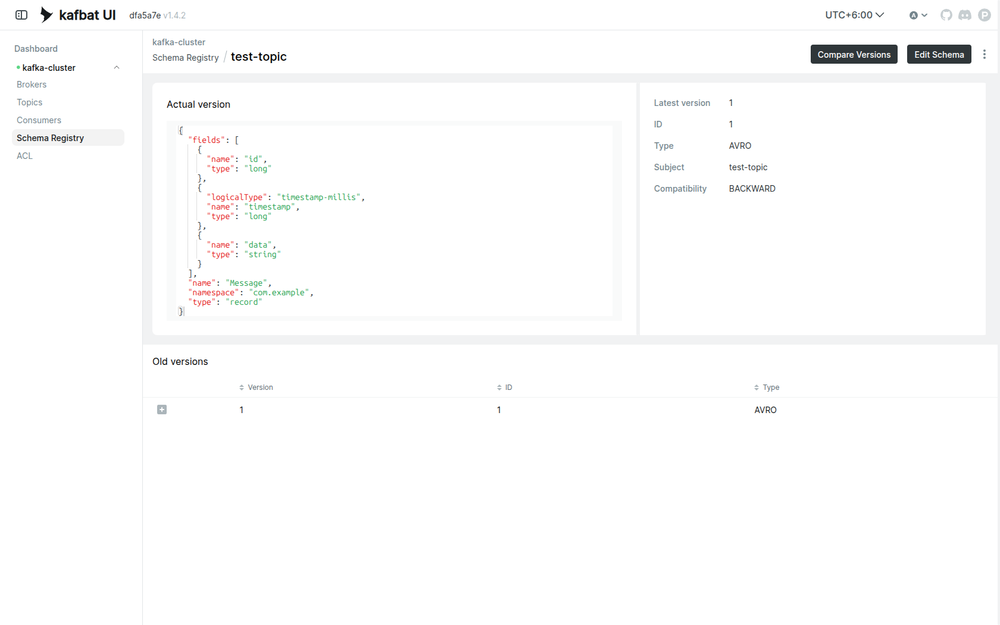

## Верификация доставки сообщений через Redis

Верификация доставки через Redis: при указании `REDIS_ADDR` Producer записывает в Redis ключ (как у сообщения) и значение = **content hash (id+data)** + timestamp. Consumer сверяет хеш только по полям id и data; различие только по timestamp (ретраи, дубликаты) не считается ошибкой. При совпадении content hash — удаление ключа и счётчик полученных. При несовпадении тела сообщения (id или data другие) — ошибка в логах и метрика `kafka_consumer_redis_hash_mismatch_total` (проблема целостности данных). Метрики `redis_pending_messages` и `redis_pending_old_messages` (старее `REDIS_SLO_SECONDS`) дают SLO по задержке доставки.

### Что даёт на стенде

- **Проверка целостности**: сравнение content hash позволяет обнаружить искажение тела сообщения в пути (Kafka, сеть, код) во время хаос-тестов.
- **Факт доставки**: удаление ключа из Redis после успешной обработки даёт явный сигнал «сообщение доставлено и проверено».
- **SLO по задержке доставки**: счётчик «старых» pending-ключей (старше N секунд) показывает, укладывается ли система в допустимое время доставки при сбоях.

### Известные ограничения

1. **Два хранилища без транзакции** — при сбое между записью в Kafka и Redis возможна рассинхронизация: ключа нет в Redis, хотя сообщение отправлено. На стенде это допустимо и учитывается при анализе результатов.
2. **Нет идемпотентности** — при at-least-once повторная доставка может завысить счётчик `received`. Для целей хаос-тестирования это не критично.
3. **Утечка ключей при остановке Consumer** — без TTL ключи накапливаются. На стенде используется TTL для автоматической очистки.

> **Примечание:** данная верификация предназначена исключительно для этого тестового стенда и не рассчитана на использование в продакшене.

## VictoriaLogs

**VictoriaLogs** - хранилище логов от VictoriaMetrics с поддержкой LogsQL в Grafana.

**Важно:** VictoriaMetrics K8s Stack должен быть установлен первым (он предоставляет CRD VMServiceScrape и т.п., используемые чартом VictoriaLogs).

### Установка VictoriaLogs (cluster)

Используется файл `victoria-logs-cluster-values.yaml` из репозитория (Ingress для vlselect на `victorialogs.apatsev.org.ru`, retention 1d, PVC 20Gi).

```bash
helm repo add vm https://victoriametrics.github.io/helm-charts/
helm repo update

helm upgrade --install victoria-logs-cluster vm/victoria-logs-cluster \
  --namespace victoria-logs-cluster \
  --create-namespace \
  --wait \
  --version 0.0.27 \
  --timeout 15m \
  -f victoria-logs-cluster-values.yaml
```

Ссылка на исходный код: [`victoria-logs-cluster-values.yaml`](https://github.com/patsevanton/strimzi-kafka-chaos-testing/blob/main/victoria-logs-cluster-values.yaml)

Чтобы VMAgent из VictoriaMetrics K8s Stack собирал метрики VictoriaLogs, на VMServiceScrape должен быть label, по которому стэк выбирает цели (например `release: vmks`). Если чарт по умолчанию задаёт другой `release`, добавьте в values или `--set` нужный label для vlselect/vlinsert/vlstorage VMServiceScrape.

Проверка: `kubectl get pods -n victoria-logs-cluster`. Доступ к UI: по адресу Ingress из values (по умолчанию `victorialogs.apatsev.org.ru`).

### Victoria-logs-collector

**Victoria-logs-collector** - Helm-чарт VictoriaMetrics, разворачивающий агент сбора логов (vlagent) как DaemonSet. Собирает логи со всех контейнеров в кластере и отправляет их в VictoriaLogs (vlinsert).

**Требование:** перед установкой должен быть развёрнут VictoriaLogs cluster (см. выше).

Используется файл `victoria-logs-collector-values.yaml` из репозитория (адрес vlinsert, поля для игнорирования, поля сообщения лога).

```bash
helm upgrade --install victoria-logs-collector vm/victoria-logs-collector \
  --namespace victoria-logs-collector \
  --create-namespace \
  --wait \
  --version 0.2.9 \
  --timeout 15m \
  -f victoria-logs-collector-values.yaml
```

Ссылка на исходный код: [`victoria-logs-collector-values.yaml`](https://github.com/patsevanton/strimzi-kafka-chaos-testing/blob/main/victoria-logs-collector-values.yaml)

Проверка: `kubectl get pods -n victoria-logs-collector`.

## Chaos Mesh

**Chaos Mesh** - платформа для chaos engineering в Kubernetes. Позволяет внедрять сбои (network, pod, I/O, time, DNS, JVM, HTTP) для тестирования отказоустойчивости Kafka и приложений. Манифесты взяты из [strimzi-kafka-chaos-testing](https://github.com/patsevanton/strimzi-kafka-chaos-testing) и адаптированы под namespace `kafka-cluster` и кластер `kafka-cluster`.

### Установка Chaos Mesh

```bash
helm repo add chaos-mesh https://charts.chaos-mesh.org
helm repo update

helm upgrade --install chaos-mesh chaos-mesh/chaos-mesh \
  --namespace chaos-mesh \
  --create-namespace \
  -f chaos-mesh/chaos-mesh-values.yaml \
  --version 2.8.1 \
  --wait
```

Ссылка на исходный код: [`chaos-mesh/chaos-mesh-values.yaml`](https://github.com/patsevanton/strimzi-kafka-chaos-testing/blob/main/chaos-mesh/chaos-mesh-values.yaml)

Проверка: `kubectl get pods -n chaos-mesh`

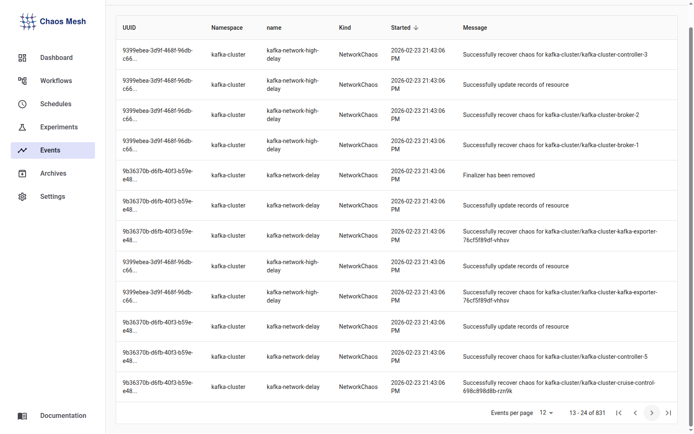

Для сбора метрик Chaos Mesh через VictoriaMetrics K8s Stack примените VMServiceScrape (в кластере используются CRD VictoriaMetrics, не Prometheus ServiceMonitor):

```bash
kubectl apply -f chaos-mesh/chaos-mesh-vmservicescrape.yaml
```

Ссылка на исходный код: [`chaos-mesh/chaos-mesh-vmservicescrape.yaml`](https://github.com/patsevanton/strimzi-kafka-chaos-testing/blob/main/chaos-mesh/chaos-mesh-vmservicescrape.yaml)

### Доступ к Dashboard

Dashboard использует RBAC-токен. Создайте ServiceAccount и токен:

```bash
kubectl apply -f chaos-mesh/chaos-mesh-rbac.yaml
sleep 3
kubectl get secret chaos-mesh-admin-token -n chaos-mesh -o jsonpath='{.data.token}' | base64 -d; echo
```

Ссылка на исходный код: [`chaos-mesh/chaos-mesh-rbac.yaml`](https://github.com/patsevanton/strimzi-kafka-chaos-testing/blob/main/chaos-mesh/chaos-mesh-rbac.yaml)

Скопируйте токен и войдите в Chaos Mesh Dashboard. В `chaos-mesh-values.yaml` задан Ingress-хост `chaos-dashboard.apatsev.org.ru` (при необходимости измените под свой домен).

### Chaos-эксперименты

После установки Chaos Mesh примените **все эксперименты последовательно** из `chaos-experiments/` с таймаутом между ними (5–10 минут), проверьте статус каждого (`kubectl get podchaos,... -n kafka-cluster`) и убедитесь, что кластер реагирует (Grafana, логи). Пропуск этого шага означает неполное развёртывание.

В директории **chaos-experiments/** лежат готовые эксперименты для Kafka, Schema Registry, Kafka UI и producer/consumer (CRD Chaos Mesh):

| Файл | Тип | Описание |
|------|-----|----------|
| `pod-kill.yaml` | PodChaos + Schedule | Убийство брокера (одноразово + каждые 5 мин) |
| `pod-failure.yaml` | PodChaos | Симуляция падения пода |
| `network-delay.yaml` | NetworkChaos | Сетевые задержки 100–500 ms |
| `cpu-stress.yaml` | StressChaos | Нагрузка на CPU |
| `memory-stress.yaml` | StressChaos | Нагрузка на память |
| `io-chaos.yaml` | IOChaos | Задержки и ошибки дискового I/O |
| `time-chaos.yaml` | TimeChaos | Смещение системного времени |
| `jvm-chaos.yaml` | JVMChaos | GC, CPU/memory stress, latency, exception в JVM |
| `http-chaos.yaml` | HTTPChaos | Задержки/ошибки Schema Registry и Kafka UI |
| `network-partition.yaml` | NetworkChaos | Изоляция брокера / partition между брокерами и producer |
| `network-loss.yaml` | NetworkChaos | Потеря пакетов 10–30% |
| `dns-chaos.yaml` | DNSChaos | Ошибки DNS (брокеры, producer) |

Ссылка на исходный код: [chaos-experiments/](https://github.com/patsevanton/strimzi-kafka-chaos-testing/tree/main/chaos-experiments)

Порядок запуска и таймауты:

```bash
# 1. Pod kill (убийство брокера)
kubectl apply -f chaos-experiments/pod-kill.yaml
# Затронутые поды: kafka-cluster-cruise-control-66d566d69-* (mode one - один из Kafka-подов убит, в прогоне - cruise-control). Логи (новый под после рестарта): KafkaCruiseControlSampleStore consumer unregistered, Sample loading finished, CruiseControlStateRequest, "GET /kafkacruisecontrol/state HTTP/1.1" 200
sleep 60
kubectl delete -f chaos-experiments/pod-kill.yaml

# 2. Pod failure (симуляция падения пода)
kubectl apply -f chaos-experiments/pod-failure.yaml
# Затронутые поды: kafka-pod-failure (one) - kafka-cluster-kafka-exporter-*; kafka-multi-pod-failure (60%) - kafka-cluster-broker-2, kafka-cluster-kafka-exporter-*, kafka-cluster-cruise-control-*, kafka-cluster-controller-4. Логи (exporter после восстановления): kafka_exporter.go Starting, Error Init Kafka Client: connection refused
sleep 60
kubectl delete -f chaos-experiments/pod-failure.yaml

# 3. CPU stress (нагрузка на CPU)
kubectl apply -f chaos-experiments/cpu-stress.yaml
# Затронутые поды: kafka-cpu-stress (one) - kafka-cluster-controller-5; kafka-cpu-stress-high (all) - controller-3, controller-4, controller-5, entity-operator/topic-operator. Логи (controller): PartitionChangeBuilder Setting new leader, QuorumController handleBrokerUnfenced, ReplicationControlManager CreateTopics
sleep 60
kubectl delete -f chaos-experiments/cpu-stress.yaml

# 4. Memory stress (нагрузка на память)
kubectl apply -f chaos-experiments/memory-stress.yaml
# Затронутые поды: kafka-memory-stress (one) - kafka-cluster-broker-0; kafka-combined-stress (one) - один из broker/controller. Логи: возможны OOMKilled, в брокере - replication/request timeouts при нехватке памяти
sleep 60
kubectl delete -f chaos-experiments/memory-stress.yaml

# 5. IO chaos (задержки и ошибки дискового I/O)
kubectl apply -f chaos-experiments/io-chaos.yaml
# Затронутые поды: mode one - один из брокеров/контроллеров (broker-0, controller-5 и т.д.). Примечание: может быть FAILED из-за volumePath (например "No such file" если путь не совпадает с реальным). Логи: задержки записи/чтения, I/O errors в логах Kafka
sleep 60
kubectl delete -f chaos-experiments/io-chaos.yaml

# 6. Time chaos (смещение системного времени)
kubectl apply -f chaos-experiments/time-chaos.yaml
# Затронутые поды: kafka-time-skew (one) - в прогоне kafka-cluster-controller-4; остальные timechaos - по одному поду из Kafka. Логи: NotControllerException, QuorumController replay, ACL Denied, рассинхрон часов
sleep 60
kubectl delete -f chaos-experiments/time-chaos.yaml

# 7. JVM chaos (GC, stress и исключения в JVM)
kubectl apply -f chaos-experiments/jvm-chaos.yaml
# Затронутые поды: по одному поду на каждый JVMChaos - controller (GC), broker (exception handleProduceRequest, stress, latency append). Логи: GC паузы, IOException Chaos test exception в handleProduceRequest, задержки append
sleep 60
kubectl delete -f chaos-experiments/jvm-chaos.yaml

# 8. HTTP chaos (задержки/ошибки Schema Registry и Kafka UI)
kubectl apply -f chaos-experiments/http-chaos.yaml
# Затронутые поды: schema-registry-* (все в ns schema-registry), kafka-ui-* (ns kafka-ui). Логи: Karapace heartbeat, Received successful heartbeat response, "GET /subjects HTTP/1.1" 200
sleep 60
kubectl delete -f chaos-experiments/http-chaos.yaml

# 9. DNS chaos (ошибки DNS для брокеров и producer)
kubectl apply -f chaos-experiments/dns-chaos.yaml
# Затронутые поды: kafka-cluster (one/all по манифесту) - один или все брокеры/контроллеры; kafka-producer (ns kafka-producer) - поды kafka-producer-*. Логи: UnknownHostException, kafka-dns-error может быть FAILED при неверном pattern
sleep 60
kubectl delete -f chaos-experiments/dns-chaos.yaml

# 10. Network partition (сетевая изоляция)
kubectl apply -f chaos-experiments/network-partition.yaml
# Затронутые поды: kafka-network-partition (one) - в прогоне kafka-cluster-broker-2; kafka-producer-partition - все брокеры (broker-0, broker-1, ...) и поды kafka-producer в ns kafka-producer. Логи: producer retries, connection timeouts, leader unavailable
sleep 60
kubectl delete -f chaos-experiments/network-partition.yaml

# 11. Network loss (потеря пакетов)
kubectl apply -f chaos-experiments/network-loss.yaml
# Затронутые поды: все поды Kafka в kafka-cluster (broker-*, controller-*, cruise-control, entity-operator, kafka-exporter); producer/consumer - потеря пакетов, retry в логах приложений
sleep 60
kubectl delete -f chaos-experiments/network-loss.yaml

# Network delay (сетевые задержки) - отладка, по умолчанию не запускаем
kubectl apply -f chaos-experiments/network-delay.yaml
# Затронутые поды: все поды Kafka в kafka-cluster (mode all); producer/consumer - рост latency в логах и метриках
sleep 60
kubectl delete -f chaos-experiments/network-delay.yaml
```

Проверка статуса (все задействованные namespace):

```bash
kubectl get podchaos,networkchaos,stresschaos,iochaos,timechaos,jvmchaos,httpchaos,dnschaos,schedule -n kafka-cluster
kubectl get dnschaos -n kafka-producer
kubectl get httpchaos -n schema-registry
kubectl get httpchaos -n kafka-ui
```

**Остановка всех экспериментов:** `kubectl delete -f chaos-experiments/`

## Импорт дашбордов Grafana

Импорт: Grafana → Dashboards → Import → загрузить JSON. Источник метрик — VictoriaMetrics.

### Strimzi Kafka

Ссылка: [strimzi-kafka.json](https://github.com/strimzi/strimzi-kafka-operator/blob/main/packaging/examples/metrics/grafana-dashboards/strimzi-kafka.json)

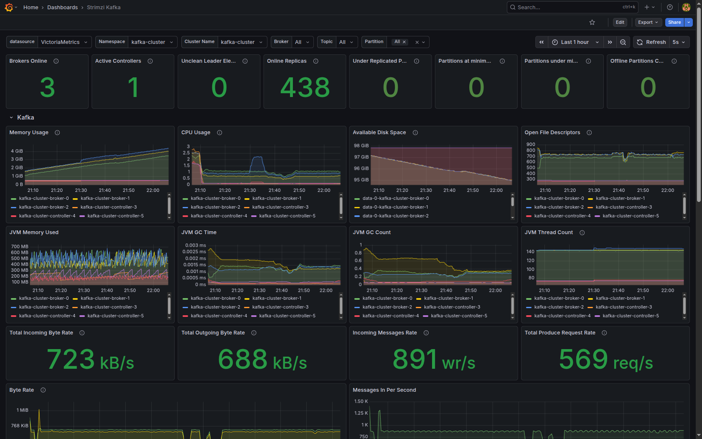

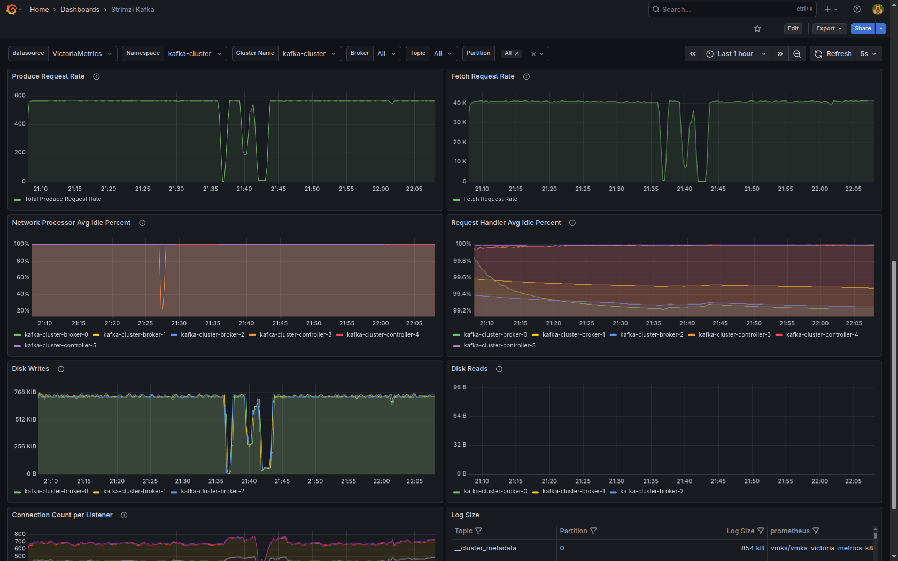

### Strimzi KRaft

Ссылка: [strimzi-kraft.json](https://github.com/strimzi/strimzi-kafka-operator/blob/main/packaging/examples/metrics/grafana-dashboards/strimzi-kraft.json)

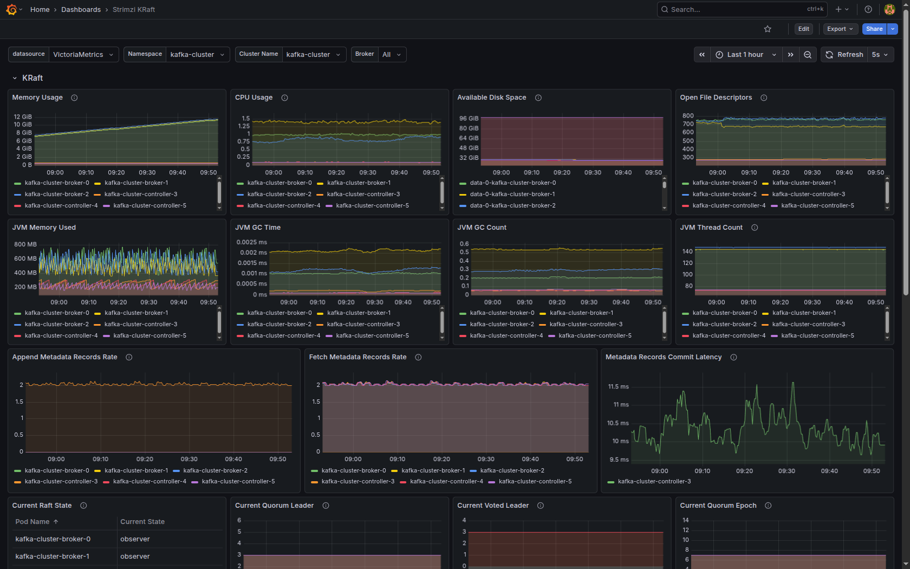

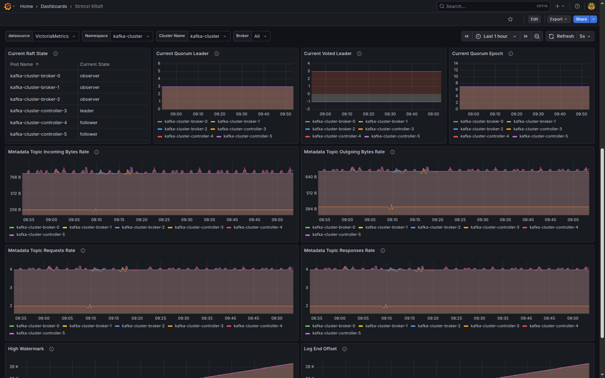

### Strimzi Kafka Exporter

Ссылка: [strimzi-kafka-exporter.json](https://github.com/strimzi/strimzi-kafka-operator/blob/main/packaging/examples/metrics/grafana-dashboards/strimzi-kafka-exporter.json)

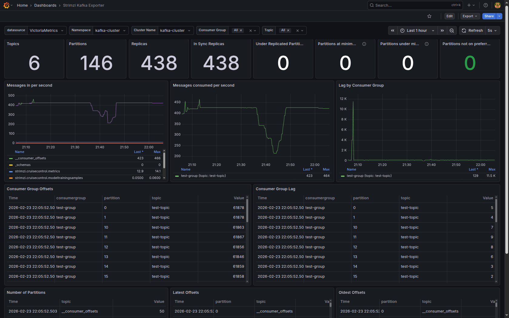

### Strimzi Operators

Ссылка: [strimzi-operators.json](https://github.com/strimzi/strimzi-kafka-operator/blob/main/packaging/examples/metrics/grafana-dashboards/strimzi-operators.json)

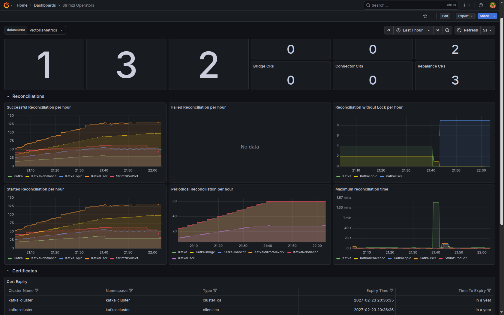

### Kafka Go App Metrics (Producer/Consumer)

Ссылка: [`dashboards/kafka-go-app-metrics.json`](https://github.com/patsevanton/strimzi-kafka-chaos-testing/blob/main/dashboards/kafka-go-app-metrics.json) — метрики Go-приложения (Producer/Consumer, Kafka, Schema Registry)

Дашборд включает панели для:
- **Producer метрики**: скорость отправки сообщений, latency, ошибки
- **Consumer метрики**: скорость получения сообщений, latency, lag, ошибки
- **Schema Registry метрики**: запросы, latency, ошибки, кэш
- **Connection метрики**: статус подключений, переподключения

Подробное описание панелей и инструкции по импорту — в **dashboards/README.md**.

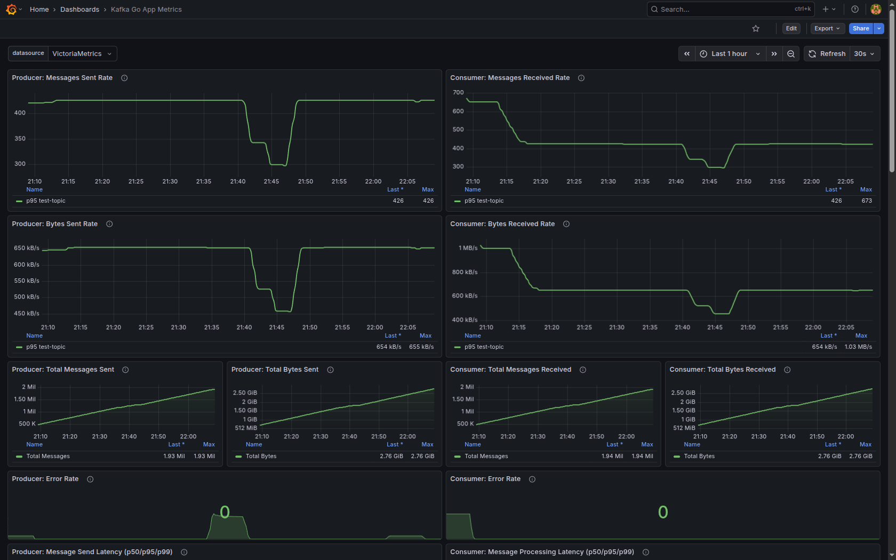

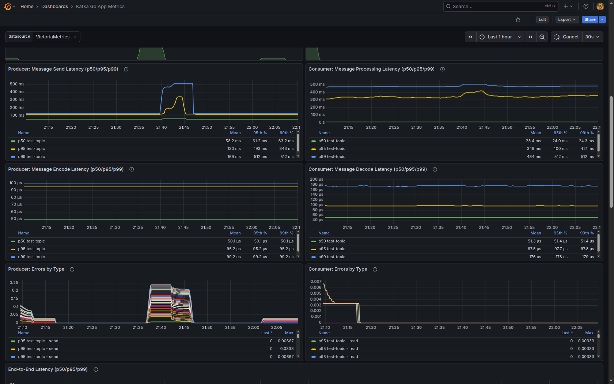

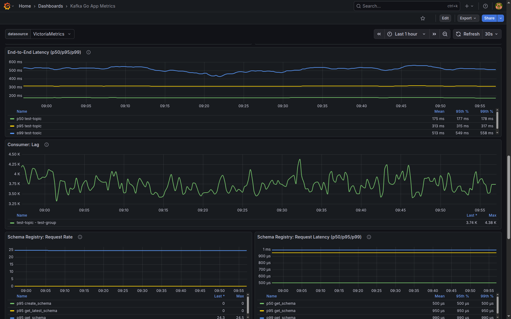

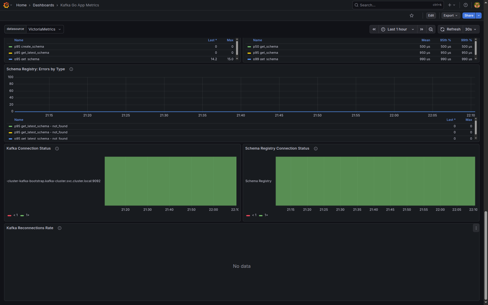

### Redis Delivery Verification

Ссылка: [`dashboards/redis-delivery-verification.json`](https://github.com/patsevanton/strimzi-kafka-chaos-testing/blob/main/dashboards/redis-delivery-verification.json) — Redis, SLO и верификация доставки ([подробнее](#верификация-доставки-сообщений-через-redis))

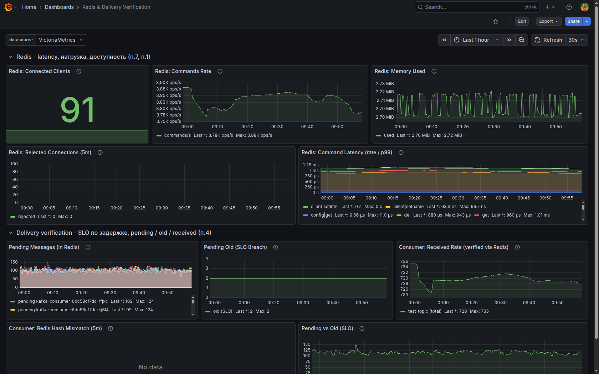

## Наблюдение за состоянием кластера на дашбордах Grafana

Импортированные дашборды позволяют отслеживать состояние кластера до, во время и после chaos-экспериментов. Откройте Grafana http://grafana.apatsev.org.ru, выберите нужный дашборд и временной диапазон, охватывающий момент запуска и остановки эксперимента.

| Дашборд | Что смотреть при chaos |
|--------|-------------------------|
| **Strimzi Kafka / Strimzi KRaft** (импорт из Strimzi) | Состояние брокеров, реплик, under-replicated партиций; полезно при pod-kill, pod-failure, network-* |
| **Strimzi Kafka Exporter** | Метрики топиков, consumer groups, lag; при сетевых и pod-экспериментах - рост lag, изменение throughput |
| **Strimzi Operators** | Реконсиляция Cluster Operator, Topic/User Operator; при убийстве подов - всплески активности |
| **kafka-go-app-metrics** (`dashboards/kafka-go-app-metrics.json`) | Producer/Consumer: сообщения в сек, latency, ошибки, переподключения; при network-delay/loss - рост latency и ошибок |
| **redis-delivery-verification** (`dashboards/redis-delivery-verification.json`) | SLO доставки, pending/old messages; при сбоях доставки - рост старых сообщений в Redis |

Рекомендуемый порядок: перед запуском экспериментов откройте дашборды Strimzi Kafka и kafka-go-app-metrics, установите автообновление (например, 10–30 s). Запускайте эксперименты последовательно с таймаутом между ними (см. выше), наблюдайте метрики во время каждого эксперимента. После завершения эксперимента он удаляется автоматически - убедитесь в восстановлении кластера (lag снижается, ошибок нет, latency в норме) перед запуском следующего.

### Ресурсы и производительность

**Ресурсы (конфигурация из манифестов и Helm values):**

| Компонент | Реплики | CPU (requests / limits) | Память (requests / limits) | Хранилище |
|-----------|---------|-------------------------|----------------------------|-----------|
| Kafka (controller + broker) | 3 + 3 | по умолчанию Strimzi | по умолчанию Strimzi | 100 Gi на ноду (JBOD) |
| Топик test-topic | 30 партиций, 3 реплики | - | - | - |
| Producer | 30 | 500m / 2000m на под | 256Mi / 1Gi на под | - |
| Consumer | 30 | 500m / 2000m на под | 256Mi / 1Gi на под | - |
| Schema Registry (Karapace) | 2 | 100m / 500m | 256Mi / 512Mi | - |
| Redis | 1 | 50m / 200m | 128Mi / 256Mi | - |

**Целевые показатели производительности (расчёт по конфигу):** Producer: до 20 msg/s на под при `producerIntervalMs: 50` → до **600 msg/s** суммарно при 30 подах. Consumer: 30 партиций, по одной на под, fetch до 100 MB за запрос; потребление ограничено скоростью producer и настройками `minBytes`/`maxWaitMs`. SLO доставки (Redis): сообщения должны быть обработаны consumer в течение **120 с** (`redis.sloSeconds`); старые сообщения выше порога отображаются в дашборде redis-delivery-verification. Фактические throughput и latency зависят от кластера и нагрузки; их можно смотреть в Grafana (дашборды kafka-go-app-metrics, Strimzi Kafka Exporter).

## Заключение

Все chaos-эксперименты завершились успешно: кластер Strimzi Kafka продемонстрировал устойчивость к каждому из протестированных сценариев сбоев. В ходе экспериментов были последовательно применены pod-kill, pod-failure, CPU/memory stress, IO chaos, time chaos, JVM chaos, HTTP chaos, DNS chaos, network partition и network loss — и во всех случаях кластер корректно восстанавливался после снятия нагрузки.

Ключевые результаты:
- **Целостность данных:** при убийстве брокеров, сетевых разделениях и потере пакетов ни одно сообщение не было потеряно — верификация через Redis подтвердила сквозную доставку в рамках SLO (120 с);
- **Автоматическое восстановление:** после каждого эксперимента брокеры возвращались в кластер, under-replicated партиции синхронизировались, consumer lag снижался до нуля без ручного вмешательства;
- **Устойчивость producer/consumer:** Go-приложения корректно обрабатывали переподключения, retry и временные ошибки — throughput и latency возвращались к baseline-значениям после завершения каждого эксперимента;
- **Наблюдаемость:** дашборды Grafana (Strimzi Kafka, kafka-go-app-metrics, redis-delivery-verification) позволили в реальном времени отследить деградацию и восстановление на каждом этапе.

Таким образом, конфигурация Strimzi Kafka с 3 контроллерами, 3 брокерами, `min.insync.replicas: 2`, 30 партициями и 3 репликами обеспечивает достаточный уровень отказоустойчивости для типовых инцидентов в Kubernetes-среде.